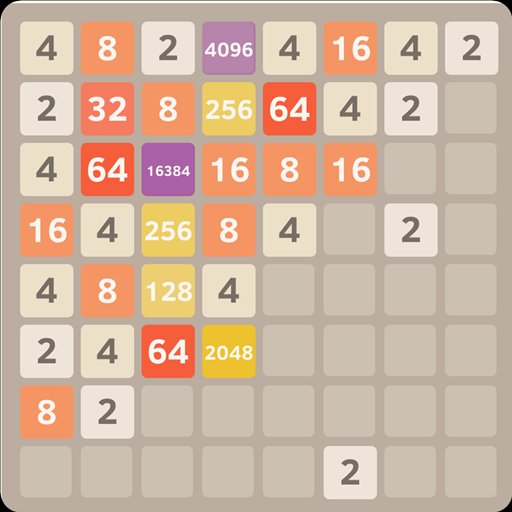

# 3D 2048

#### 3D 2048
- 참고용 스크린샷

#### 게임 개요
정육면체 프레임 안에서 진행하는 3x3x3 3D 2048 
- 6개의 방향키로 위아래,양옆,앞뒤로 프레임 안의 정육면체 숫자 모듈을 한쪽으로 이동
- 같은 숫자의 모듈은 충돌 시 합쳐지며 합친 숫자 모듈로 변함
- 다른 숫자의 모듈은 충돌 시 이동 방해
- 프레임에 해당되는 큰 정육면체는 바깥면을 은면처리
    + 밖에서 안을 볼 수 있지만 안쪽면은 정상적으로 출력

#### 구현 내용
- 큰 정육면체와 안의 작은 정육면체 모듈
- 6개의 방향에 대한 중력 처리
- 작은 정육면체 모듈들의 충돌 판정과 충돌 시 조건 처리
    + 다른 숫자 모듈의 경우 이동 방해
    + 같은 숫자 모듈의 경우 합체
